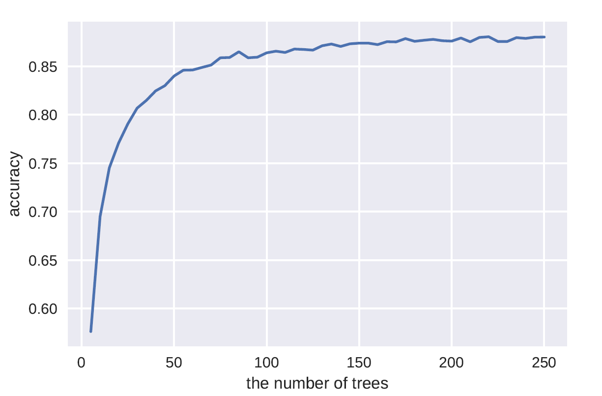
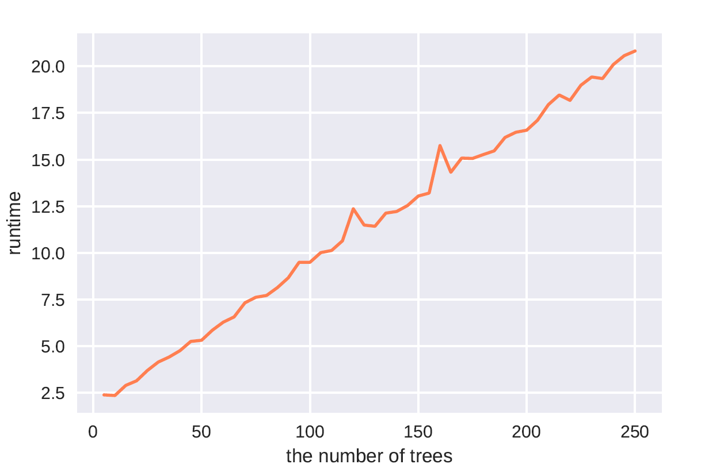
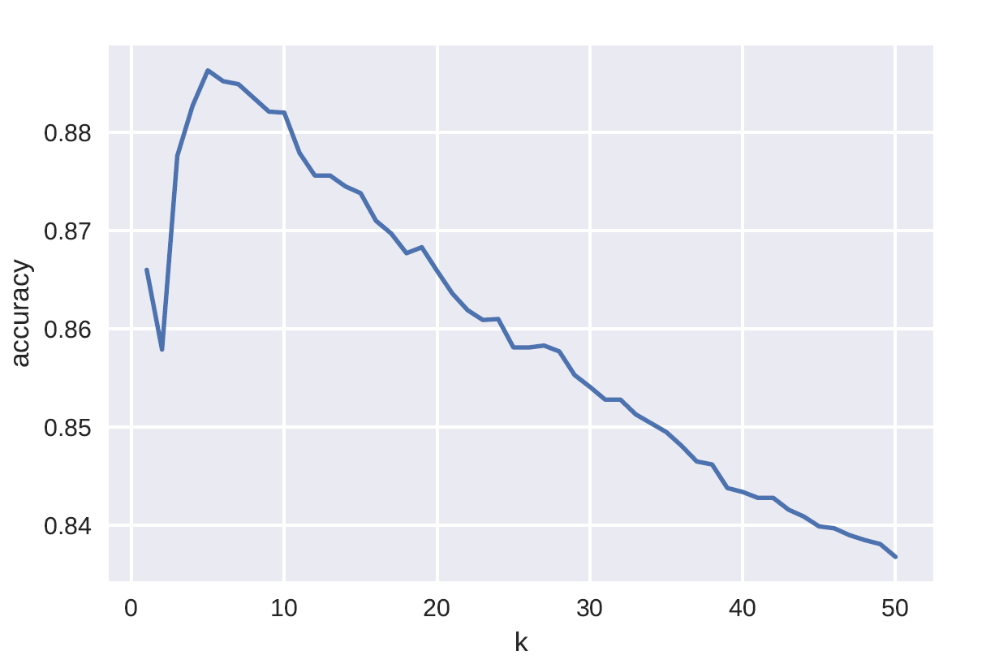
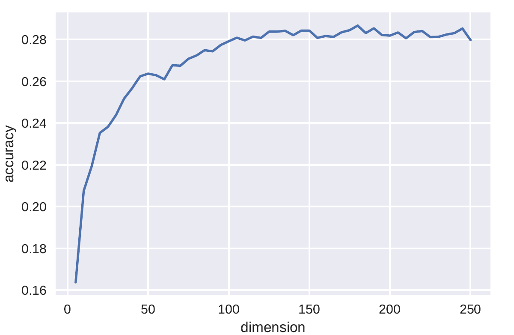
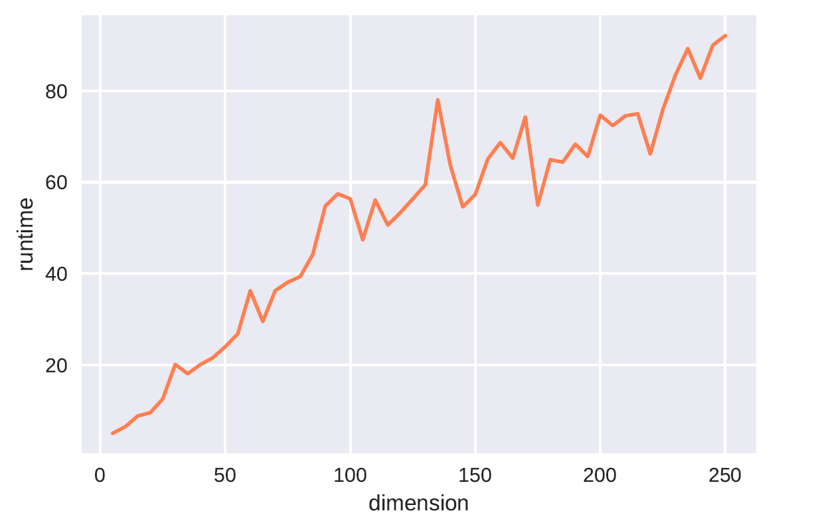
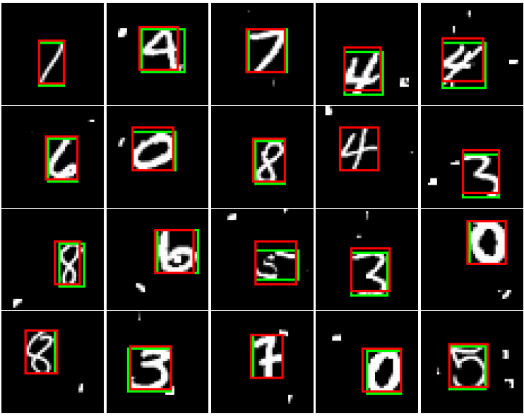

# CS420 Machine Learning, Final Project
Classification on modified MNIST dataset

* [Requirements](#Requirements)
* [Prepare Data](#Prepare Data)
* [Traditonal Methods](#Traditonal Methods)
* [Deep Learning Methods](#Deep Learning Methods)

## Requirements
- [NumPy](https://github.com/numpy/numpy)
- [Pillow](https://github.com/python-pillow/Pillow)
- [Matplotlib](https://github.com/matplotlib/matplotlib)
- [scikit-learn](http://scikit-learn.org/stable/index.html)
- [PyTorch](https://github.com/pytorch/pytorch)==0.4.0

## Prepare Data
Download datasets from [jbox](https://jbox.sjtu.edu.cn/l/VooiCd) and move them to [mnist/](./mnist) folder, the folder structure should look like this:

    ---- mnist/
        ---- mnist_train/
        ---- mnist_test/

## Traditonal Methods

### Naive Bayes

```shell
cd traditional_methods/NaiveBayes/;
python Bayes.py
```

### Decision Tree

```shell
cd traditional_methods/DecisionTree/;
python Tree.py
```

### Random Forest

```shell
cd traditional_methods/RandomForest/;
python ForestBestN.py
```

These commands will output the performance of random forest with different number of decision trees, demonstrated by the following two figures.

<figure class="half">
    
    
</figure>

### K-Nearest Neighbors

```shell
cd traditional_methods/KNN/;
python KNNBestK.py
```

These commands will output the performance of KNN with different K, demonstrated by the following figure.

<figure>
    
</figure> 

### Support Vector Machine

```shell
cd traditional_methods/SVM/;
python SVMBestDim.py
```

These commands will output the performance of linear SVM on different dimension data reduced by PCA, demonstrated by the 
following two figures.

<figure class="half">
    
    
</figure>

```shell
cd traditional_methods/SVM/;
python SVMBestKernel.py
```

These commands will output the performance of SVM with different kernels.

### Influence of Modification

For five traditional models above, running `*Preprocess.py` in their respective directory will give 
the results as the following table shows.

|  | Naive Bayes | Desision Tree | Random Forest | K-Nearest Neighbor | SVM |
| :----: |:------------:| :----: |:------------:| :-: | :-: |
| Target dataset | 18.81% | 50.94% | 87.61% | 88.63% | 87.07% |
| Keep largest CC | 19.73% | 55.54% | 89.07% | 88.73% |88.29%|
| Shift CC to center | 75.90% | 92.69% | 98.46% | 97.55% | 96.85%|

## Deep Learning Methods
In this section, we implement FC and CNN baselines for classification. Three methods are proposed to improve the performance:

- **PointNet**
- **SegNet**
- **LocNet**

### Usage

Each model is in a seperate folder in [deep_learning_methods/](./deep_learning_methods). To train a model, please go into the corresponding folder and run `train_xxx.py`. For example, to train a baseline CNN model, you can do as follows:

```python
cd deep_learning_methods/CNN_baseline/
python train_cnn.py
```

### Deep Model Performance

||Baseline|Largest CC|CC Centralization|SegNet|LocNet|
|:---:|:---:|:---:|:---:|:---:|:---:|
|FC|90.11|92.46|92.78|99.03|**99.28**|
|CNN|99.47|99.31|99.40|99.88|**99.90**|
|PointNet|91.02|

___note___: ``CC'' stands for connected components.

### SegNet Result Visualization

<div align=center>

</div>

### LocNet Result Visualization

<div align=center>

</div>