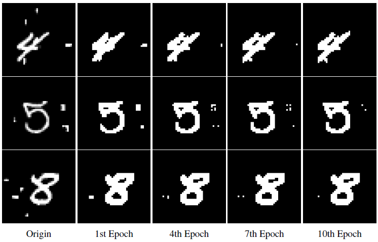

# CS420 Machine Learning, Final Project
Classification on modified MNIST dataset

## Requirements
- [NumPy](https://github.com/numpy/numpy)
- [Pillow](https://github.com/python-pillow/Pillow)
- [Matplotlib](https://github.com/matplotlib/matplotlib)
- [scikit-learn](http://scikit-learn.org/stable/index.html)
- [PyTorch](https://github.com/pytorch/pytorch) [0.4]

## Prepare Data
Download datasets from [jbox](https://jbox.sjtu.edu.cn/l/VooiCd) and move them to [mnist](./mnist) folder, the folder structure should look like this:

    ---- mnist/
        ---- mnist_train/
        ---- mnist_test/

## Tratditonal Methods

## Deep Learning Methods

### SegNet Result Visualization

### LocNet Result Visualization

